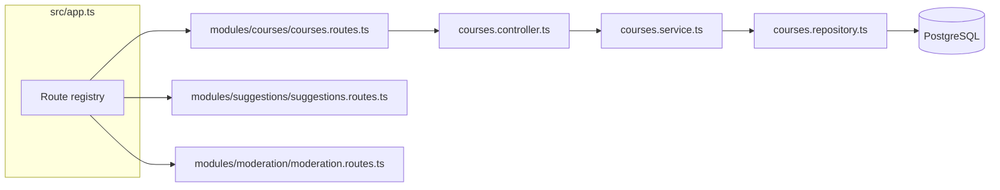

import Tabs from '@theme/Tabs';
import TabItem from '@theme/TabItem';

This document is the contract every backend endpoint follows, regardless of who writes it or which module it lives in. Read this **before** writing your first route, not after — retrofitting conventions onto ten already-built modules is far more painful than agreeing on them once.

:::info Why this document exists
With 6 people and roughly a dozen entities (courses, lessons, suggestions, flags, assessments, results, forks, reputation events, conversation spaces, sessions, notifications...), the risk isn't that any single endpoint is badly built — it's that ten people each invent a slightly different shape, and integrating them in week 5 becomes its own project. This doc removes that decision from every individual PR.
:::

---

## 1. How a request gets wired — the module pattern

At this scale, don't organize the backend by technical layer alone (`controllers/`, `services/`, `routes/` as flat top-level folders holding every entity mixed together). With ~12 entities, that gives you a `controllers/` folder with 12+ unrelated files and no obvious ownership boundary.

Instead, organize **by feature module**, with layers nested inside each:

```
backend/src/modules/
  courses/
    courses.routes.ts
    courses.controller.ts
    courses.service.ts
    courses.repository.ts
    courses.schema.ts        # Zod validation schemas
    courses.test.ts
  suggestions/
    suggestions.routes.ts
    suggestions.controller.ts
    suggestions.service.ts
    suggestions.repository.ts
    suggestions.schema.ts
    suggestions.test.ts
  moderation/
    moderation.routes.ts
    ...
  assessments/
  conversation-spaces/
  reputation/
  notifications/
```

Each module is small enough that its owner (per your team's ownership table) can hold the whole thing in their head, and a PR touching `suggestions/` never conflicts with one touching `assessments/`.

### Wiring it together



A single `src/routes/index.ts` file registers every module's router under its base path — this is the **only** shared file that every module touches, so keep it trivial:

```ts
// src/routes/index.ts
import { Router } from 'express';
import { coursesRouter } from '../modules/courses/courses.routes';
import { suggestionsRouter } from '../modules/suggestions/suggestions.routes';
import { moderationRouter } from '../modules/moderation/moderation.routes';

const router = Router();
router.use('/courses', coursesRouter);
router.use('/suggestions', suggestionsRouter);
router.use('/moderation', moderationRouter);

export default router;
```

:::warning Common mistake
Letting this registry file grow logic beyond route mounting. It should only ever import and mount — no validation, no business logic. If it starts doing more than that, the logic belongs in a module.
:::

---

## 2. Base path and versioning

Every route sits under `/api/v1`. Add this now — it costs nothing today and saves a painful migration later if the contract needs to change mid-project.

```
https://api.openlanguages.app/api/v1/courses
https://api.openlanguages.app/api/v1/courses/:courseId/lessons
```

---

## 3. Naming endpoints

Resources are plural nouns. Nesting reflects real ownership, not just relatedness — and is capped at **one level deep**. Beyond that, use a query parameter instead of further nesting.

<Tabs>
  <TabItem value="good" label="Do this" default>
    ```
    GET    /courses
    GET    /courses/:courseId
    GET    /courses/:courseId/lessons
    GET    /lessons/:lessonId/suggestions
    GET    /suggestions?lessonId=:lessonId&status=pending
    ```
  </TabItem>
  <TabItem value="bad" label="Not this">
    ```
    GET /courses/:courseId/lessons/:lessonId/suggestions/:suggestionId/reviews
    ```
    Four levels deep. If you find yourself here, the deepest resource
    (`reviews`) almost certainly deserves its own top-level route with a
    query param back to its parent.
  </TabItem>
</Tabs>

### Full resource-naming table

| Resource | Base path | Notes |
|---|---|---|
| Courses | `/courses` | |
| Lessons | `/courses/:courseId/lessons` | Nested one level — lessons don't exist outside a course |
| Suggestions | `/suggestions` | Filtered by `?lessonId=` or `?courseId=`, not nested — a suggestion is reviewed independently of browsing the course |
| Flags | `/flags` | Polymorphic target — `targetType` and `targetId` in the body, not the path |
| Moderation actions | `/moderation/actions` | |
| Moderation queue | `/moderation/queue` | Read-only, filtered/sorted view over flags |
| Assessments | `/courses/:courseId/assessments` | |
| Results | `/assessments/:assessmentId/results` | |
| Forks | `/courses/:courseId/forks` (GET), `/courses/:courseId/fork` (POST) | POST creates a new course record with `forkedFromId` set |
| Reputation events | `/users/:userId/reputation-events` | Read-only |
| Conversation spaces | `/conversation-spaces` | |
| Sessions | `/conversation-spaces/:spaceId/sessions` | |
| Notifications | `/users/me/notifications` | Always scoped to the authenticated user, never another user's ID |
| Auth-adjacent (profile) | `/users/me` | `me` is a fixed alias resolved from the JWT, not a literal user ID — prevents ever leaking another user's data through a path typo |

---

## 4. HTTP verbs and status codes

| Verb | Use for | Success code |
|---|---|---|
| `GET` | Read one or many | `200` |
| `POST` | Create | `201` |
| `PATCH` | Partial update | `200` |
| `PUT` | *Not used* — every update in this API is partial | — |
| `DELETE` | Remove | `204` (no body) |

| Situation | Code |
|---|---|
| Validation failure | `400` |
| Not authenticated (missing/invalid token) | `401` |
| Authenticated but not permitted (e.g. reputation too low, not the author) | `403` |
| Resource doesn't exist | `404` |
| Conflicting state (e.g. suggestion already resolved) | `409` |
| Rate limit exceeded | `429` |
| Unhandled server error | `500` |

:::danger Common mistake
Returning `200` with an `{ success: false }` body for errors. This breaks HTTP semantics, breaks caching, and breaks every frontend error-handling convention. Use real status codes — the frontend's API client (see Section 6 of the blueprint) branches on status code, not on a body field.
:::

---

## 5. Request and response shape

### Success responses
Return the resource directly — no unnecessary wrapper:

```json
{
  "id": "b1e2...",
  "title": "Beginner isiZulu",
  "language": "zu",
  "status": "published",
  "authorId": "9f0a...",
  "createdAt": "2026-08-01T10:00:00Z"
}
```

List endpoints wrap in a `data` + `meta` envelope, since pagination metadata has to live somewhere:

```json
{
  "data": [ { "id": "...", "title": "..." } ],
  "meta": { "page": 1, "limit": 20, "total": 143 }
}
```

### Error responses
Every error, from every module, uses this exact shape:

```json
{
  "error": {
    "code": "VALIDATION_ERROR",
    "message": "title is required",
    "fields": ["title"]
  }
}
```

`code` is a stable machine-readable string (`VALIDATION_ERROR`, `NOT_FOUND`, `FORBIDDEN`, `CONFLICT`) the frontend can switch on without parsing `message`, which is for humans and may change wording over time.

### Field naming
`camelCase` in JSON, always — even though the database uses `snake_case`. Convert at the repository boundary (Prisma does this automatically if you map field names in the schema), so no module leaks `snake_case` into a response.

---

## 6. Pagination, filtering, sorting

Every list endpoint supports the same three query parameters, handled by one shared middleware/utility rather than reimplemented per module:

```
GET /courses?page=2&limit=20&language=zu&level=beginner&sort=-createdAt
```

- `page` / `limit` — 1-indexed, default `limit=20`, max `limit=100`
- Filters are plain query params matching a field name — only fields explicitly allow-listed per module are filterable (don't allow filtering on arbitrary columns)
- `sort` — field name, prefix `-` for descending (`-createdAt`)

:::tip
Write the pagination/sort parsing once as a shared middleware (`parseListQuery`), and have every module's list controller call it. This is exactly the kind of utility that saves six people from writing six slightly different pagination bugs.
:::

---

## 7. Validation

Every module defines its request schemas in its own `*.schema.ts` file using Zod, and a shared middleware validates the body/query/params against it before the request reaches the controller:

```ts
// modules/suggestions/suggestions.schema.ts
import { z } from 'zod';

export const createSuggestionSchema = z.object({
  lessonId: z.string().uuid(),
  change: z.string().min(1).max(5000),
});
```

```ts
// modules/suggestions/suggestions.routes.ts
router.post(
  '/',
  requireAuth,
  validate(createSuggestionSchema),
  suggestionsController.create
);
```

A failed validation always short-circuits before the controller runs, and always returns the standard `VALIDATION_ERROR` shape above.

---

## 8. Authentication and authorization on every route

Two separate middlewares, always applied in this order:

1. **`requireAuth`** — verifies the JWT from the established auth provider, attaches `req.user`. Returns `401` if missing/invalid.
2. **`requirePermission(check)`** — a module-specific function checking whether `req.user` may perform this action (ownership, reputation threshold, moderator status). Returns `403` if not.

```ts
router.patch(
  '/:courseId',
  requireAuth,
  requirePermission(isAuthorOf('courseId')),
  validate(updateCourseSchema),
  coursesController.update
);
```

:::warning Common mistake
Checking "is this user the author?" inside the controller or service instead of as an explicit middleware. Buried permission checks are the ones that get missed when a new endpoint is added in week 5 by someone unfamiliar with the module.
:::

---

## 9. Rate limiting

Applied globally via middleware, scaled by `reputationScore` rather than flat per-user — ties into the trust-engine design. Config lives in one place (`src/middleware/rate-limit.ts`), not per module:

| Reputation tier | Requests / minute |
|---|---|
| New account | 30 |
| Established contributor | 100 |
| Trusted / moderator | 300 |

Rate-limited responses return `429` with a `Retry-After` header.

---

## 10. Adding a new endpoint — checklist

Before opening a PR for any new endpoint:

- [ ] Path follows the naming table (Section 3) — one level of nesting max
- [ ] Correct verb and success status code (Section 4)
- [ ] Request validated via a Zod schema in the module's `*.schema.ts`
- [ ] `requireAuth` and, if needed, `requirePermission` applied
- [ ] Errors use the standard `{ error: { code, message } }` shape
- [ ] List endpoints support `page`/`limit`/`sort` via the shared utility
- [ ] Response fields are `camelCase`
- [ ] Endpoint documented in the API reference (path, method, request/response example) **before or alongside** implementation
- [ ] Integration test covers the success case and at least one failure case (401/403/404/409 as relevant)

---

## 11. Endpoint documentation template

Every new endpoint gets an entry like this in the docs site's API reference, filled in **before** the PR is opened — this is what lets the frontend owner start building against it without waiting for the implementation to finish.

```md
### POST /suggestions

Creates a suggestion against a lesson.

**Auth required:** yes
**Permission:** any authenticated user

**Request body**
| Field | Type | Required |
|---|---|---|
| lessonId | string (uuid) | yes |
| change | string, 1–5000 chars | yes |

**Success response — 201**
\`\`\`json
{ "id": "...", "lessonId": "...", "submittedBy": "...", "status": "pending" }
\`\`\`

**Errors**
| Code | When |
|---|---|
| 400 VALIDATION_ERROR | change is empty or too long |
| 404 NOT_FOUND | lessonId doesn't exist |
```

---

*This document governs every module. If a convention here doesn't fit a specific feature, raise it with the team rather than quietly deviating — an inconsistent API is harder to fix at week 5 than a convention is to amend at week 1.*