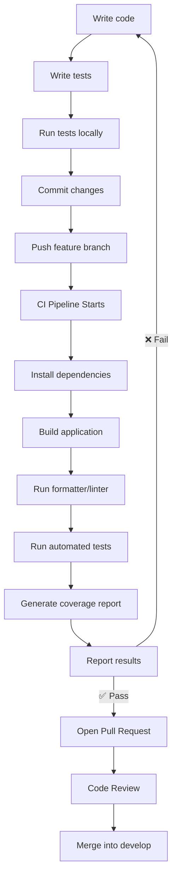
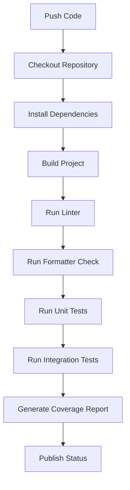

import Tabs from '@theme/Tabs';
import TabItem from '@theme/TabItem';

**Project:** Software Design Web Application &nbsp;|&nbsp; **Team Size:** 6 &nbsp;|&nbsp; **Hosting:** Gitea (University Server) &nbsp;|&nbsp; **CI/CD Platform:** Gitea Actions &nbsp;|&nbsp; **Duration:** 3 Months

## 1. Purpose

This document defines the Continuous Integration and Continuous Deployment (CI/CD) workflow that all team members must follow throughout the project.

:::tip Objectives
- Ensure every feature is tested before integration.
- Detect bugs as early as possible.
- Prevent broken code from entering the shared codebase.
- Maintain a deployable project at all times.
- Encourage automated testing rather than manual verification.
- Improve software quality and team confidence.
:::

The CI/CD pipeline is a **mandatory quality gate** for all code entering the repository.

## 2. What is CI/CD?

<Tabs>
  <TabItem value="ci" label="Continuous Integration" default>

Automatically building and testing the project whenever code is pushed or a Pull Request is opened, instead of waiting until the end of the project to discover problems.

> CI answers: **"Does this new code still work with the rest of the project?"**

  </TabItem>
  <TabItem value="cd" label="Continuous Deployment">

Automates delivery of the application after code passes all quality checks — to a development, testing, or demonstration environment. Production deployment (if applicable) should only occur from **main**.

  </TabItem>
</Tabs>

## 3. CI/CD Workflow



## 4. Development Workflow

1. Pull the latest `develop`.
2. Create a feature branch.
3. Implement the assigned feature.
4. Write tests for all new code.
5. Run tests locally.
6. Ensure the project builds successfully.
7. Commit changes.
8. Push the feature branch.
9. Wait for CI pipeline to complete.
10. Open a Pull Request only if all checks pass.
11. Obtain code review.
12. Merge into `develop`.

## 5. Testing Policy

Testing is **mandatory**. Every feature must include appropriate automated tests. No feature is considered complete until its tests have been written.

:::danger Required Rule
**If you write code, you must write tests for that code.**
:::

**Minimum expectations** for every new feature: unit tests, edge case testing, error handling tests. Where appropriate, also add integration, API, and UI/component tests.

## 6. Types of Tests

| Test Type | Purpose |
|---|---|
| Unit Tests | Test individual functions or classes in isolation |
| Integration Tests | Verify multiple components work together |
| API Tests | Validate backend endpoints |
| Component Tests | Verify frontend components behave correctly |
| End-to-End Tests *(optional)* | Simulate real user behaviour through the application |

## 7. Local Testing Before Pushing

Before pushing, run the full test suite locally. The project should build successfully, pass all tests, and produce no linting or formatting errors. Don't rely on CI to catch mistakes you could've caught locally.

:::tip Pre-Push Checklist
- [ ] Project builds successfully
- [ ] All automated tests pass
- [ ] No linting errors
- [ ] No formatting errors
- [ ] No debugging code remains
- [ ] No commented-out code remains
- [ ] New functionality includes tests
- [ ] Existing tests continue to pass
:::

## 8. Continuous Integration Pipeline

The pipeline runs automatically on every push to a feature branch or Pull Request, through these stages:

| Stage | What happens |
|---|---|
| 1. Checkout Code | Downloads the latest version of the repository |
| 2. Install Dependencies | Installs required packages (Node, Python, Java, etc.) |
| 3. Build Project | Verifies the application compiles — pipeline fails immediately if not |
| 4. Static Analysis | Linting, formatting checks, type checking (ESLint, Prettier, TypeScript) |
| 5. Run Tests | Executes the full automated test suite (unit, integration, API) |
| 6. Code Coverage | Generates a coverage report — low coverage often signals insufficient testing |
| 7. Report Status | ✅ Passed or ❌ Failed — only passing pipelines are eligible for merging |

## 9. Pull Request Requirements

A Pull Request **cannot** be merged unless:

- CI pipeline succeeds.
- All tests pass.
- Build succeeds.
- Required review is approved.

If any CI job fails, the Pull Request must remain open until resolved.

## 10. Branch Protection Rules

<Tabs>
  <TabItem value="main" label="main" default>
    <ul>
      <li>No direct pushes</li>
      <li>Pull Requests only</li>
      <li>Passing CI required</li>
      <li>Review approval required</li>
    </ul>
  </TabItem>
  <TabItem value="develop" label="develop">
    <ul>
      <li>No direct pushes</li>
      <li>Pull Requests only</li>
      <li>Passing CI required</li>
      <li>Review approval required</li>
    </ul>
  </TabItem>
</Tabs>

These protections ensure that all shared code has been automatically validated.

## 11. Test Coverage Expectations

| Component | Target Coverage |
|---|---|
| Backend Logic | ≥ 80% |
| API Endpoints | ≥ 80% |
| Frontend Components | ≥ 70% |
| Utility Functions | ≥ 90% |

Coverage should improve over time as the project grows.

## 12. Handling Failed Tests

1. Read the error logs.
2. Identify the failing test or build step.
3. Fix the issue locally.
4. Run the full test suite again.
5. Commit the fix.
6. Push the updated branch.
7. Verify that the pipeline passes.

:::danger
Do **not** merge code with failing tests.
:::

## 13. Testing Responsibilities

Every developer is responsible for writing tests for their own code, updating existing tests when modifying functionality, keeping tests maintainable, avoiding unnecessary duplication, and keeping tests fast and deterministic. Reviewers verify adequate tests accompany each Pull Request.

## 14. Recommended Project Structure

```text
project/
├── src/
├── tests/
│   ├── unit/
│   ├── integration/
│   ├── api/
│   └── components/
├── package.json
├── README.md
└── .gitea/
    └── workflows/
        └── ci.yml
```

## 15. Example CI Pipeline



## 16. Example Gitea Workflow (Node.js)

Place this file at `.gitea/workflows/ci.yml`:

```yaml
name: CI

on:
  push:
    branches:
      - feature/**
      - bugfix/**
      - refactor/**
      - docs/**
      - test/**
  pull_request:
    branches:
      - develop
      - main

jobs:
  test:
    runs-on: ubuntu-latest
    steps:
      - name: Checkout Repository
        uses: actions/checkout@v4

      - name: Setup Node
        uses: actions/setup-node@v4
        with:
          node-version: 22

      - name: Install Dependencies
        run: npm install

      - name: Check Formatting
        run: npm run format:check

      - name: Run Linter
        run: npm run lint

      - name: Run Tests
        run: npm test

      - name: Build Project
        run: npm run build
```

## 17. Definition of Done

A task is only complete when:

- [ ] The feature has been implemented.
- [ ] Tests have been written.
- [ ] All tests pass locally.
- [ ] CI pipeline passes.
- [ ] Pull Request has been reviewed.
- [ ] Pull Request has been approved.
- [ ] Pull Request has been merged.

## 18. Summary

| Rule | Requirement |
|---|---|
| Write tests for all new code | ✅ Required |
| Run tests before pushing | ✅ Required |
| CI pipeline must pass | ✅ Required |
| Pull Request required | ✅ Required |
| Code review required | ✅ Required |
| No direct pushes to `develop` | ✅ Required |
| No direct pushes to `main` | ✅ Required |
| Merge only after passing CI | ✅ Required |
| Fix failing tests immediately | ✅ Required |

## 19. Team Agreement

By contributing to this repository, each team member agrees to:

- Write automated tests for all new functionality.
- Never merge code that fails the CI pipeline.
- Run tests locally before pushing changes.
- Review teammates' Pull Requests thoroughly.
- Help maintain a stable, deployable codebase throughout the project.

Following this CI/CD strategy will help ensure a reliable development process, reduce integration issues, and maintain high software quality from the first sprint to the final release.
