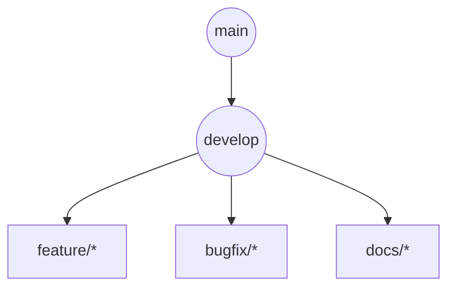
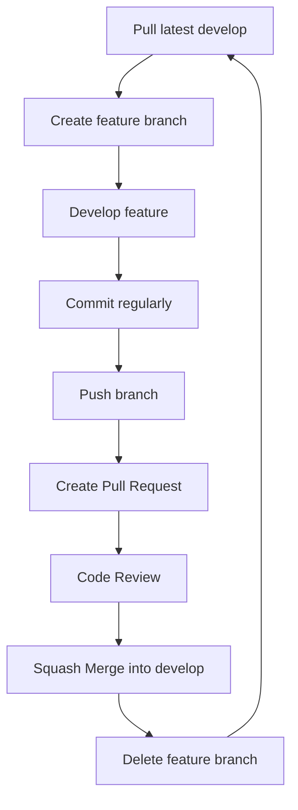

import Tabs from '@theme/Tabs';
import TabItem from '@theme/TabItem';

**Project:** Software Design Web Application &nbsp;|&nbsp; **Team Size:** 6 &nbsp;|&nbsp; **Hosting:** Gitea (University Server) &nbsp;|&nbsp; **Versioning:** CalVer &nbsp;|&nbsp; **Duration:** 3 Months

## 1. Purpose

This document defines the Git workflow that every team member must follow throughout the duration of the project.

:::tip Objectives
- Maintain a stable and functional codebase
- Minimise merge conflicts
- Ensure code is reviewed before integration
- Keep Git history clean and easy to understand
- Make changes traceable and accountable
- Standardise the team's development workflow
:::

All members are expected to follow this methodology consistently from the beginning of the project until final submission.

## 2. Repository Structure

The repository contains two long-lived branches.

| Branch | Purpose |
|---|---|
| **main** | Contains only stable, tested releases. Never used for day-to-day development. |
| **develop** | Primary development branch where completed features are integrated. |

:::danger Rules
- Never commit directly to **main**.
- Never commit directly to **develop**.
- All work must be completed on feature branches.
- All merges into **develop** must be done through Pull Requests.
:::

## 3. Branching Strategy

Every task should have its own branch, created from the latest version of **develop**.



## 4. Branch Naming Convention

| Prefix | When to Use | Example |
|---|---|---|
| `feature/` | Developing a new feature | `feature/login-page` |
| `bugfix/` | Fixing a bug | `bugfix/login-validation` |
| `refactor/` | Improving code without changing behaviour | `refactor/auth-service` |
| `docs/` | Documentation only | `docs/setup-guide` |
| `test/` | Writing or updating tests | `test/login-api` |
| `hotfix/` | Urgent production fix (only if required) | `hotfix/security-patch` |
| `chore/` | Configuration, tooling or maintenance | `chore/update-eslint` |

**Rules:** lowercase only · hyphens between words · short but descriptive · no spaces · one branch = one task.

<Tabs>
  <TabItem value="good" label="✅ Good examples" default>

```text
feature/user-profile
feature/search-page
bugfix/navbar-overflow
docs/readme
refactor/database-layer
```

  </TabItem>
  <TabItem value="bad" label="❌ Bad examples">

```text
login
mybranch
Stuff
Fix
feature/new thing
```

  </TabItem>
</Tabs>

## 5. Creating a Branch

```bash
git checkout develop
git pull origin develop
git checkout -b feature/login-page
```

Always create branches from the latest version of **develop**.

## 6. Commit Guidelines

Each commit should represent **one logical change** — e.g. complete login form, add API endpoint, fix validation bug, update documentation. Avoid combining unrelated work into a single commit.

## 7. Commit Message Convention

The same prefixes used for branch names are also used for commit messages.

| Prefix | When to Use | Example |
|---|---|---|
| `feature:` | New functionality | `feature: implement login page` |
| `bugfix:` | Bug fixes | `bugfix: fix password validation` |
| `refactor:` | Internal improvements | `refactor: simplify authentication logic` |
| `docs:` | Documentation | `docs: update installation guide` |
| `test:` | Testing | `test: add unit tests for login` |
| `hotfix:` | Critical fixes | `hotfix: resolve production authentication issue` |
| `chore:` | Maintenance | `chore: configure ESLint` |

**Rules:** present tense · lowercase · under ~72 characters · describe *what*, not how long it took.

<Tabs>
  <TabItem value="good" label="✅ Good examples" default>

```text
feature: add clinic search page
bugfix: prevent duplicate bookings
docs: update api documentation
refactor: split booking service
test: add login integration tests
```

  </TabItem>
  <TabItem value="bad" label="❌ Bad examples">

```text
Updated code
Working
Changes
asdf
Final commit
```

  </TabItem>
</Tabs>

## 8. When to Commit

Commit whenever a logical piece of work is complete: feature completed, bug fixed, tests passing, component finished, API endpoint completed, documentation updated.

:::warning Avoid committing
- Broken code
- Unfinished features
- Temporary debugging code
- Large unrelated changes
:::

A teammate should always be able to pull your commit and successfully build the project.

## 9. Pushing Changes

```bash
git push origin feature/login-page
```

Do not wait several days before pushing your work.

## 10. Keeping Your Branch Updated

Before continuing work each day:

```bash
git checkout develop
git pull origin develop
git checkout feature/login-page
git merge develop
```

Resolve any merge conflicts before continuing development.

## 11. Pull Request (PR) Workflow

Every completed feature must be merged using a Pull Request. No direct merges are permitted.

1. Push your branch to Gitea: `git push origin feature/login-page`
2. Open the repository in Gitea.
3. Click **Pull Requests** → **New Pull Request**.
4. Set Base Branch = `develop`, Compare Branch = your feature branch.
5. Verify that only the intended changes appear.
6. Give the PR a descriptive title, e.g. `feature: implement login page`.
7. Write a short description using the template below.
8. Assign at least one reviewer and submit.

```text
## Summary
Implemented user login functionality.

## Changes
- Added login page
- Added authentication API
- Added validation

## Testing
- Tested locally
- No known issues
```

## 12. Pull Request Requirements

Before requesting a review, ensure that:

- Project builds successfully
- No merge conflicts exist
- Code has been tested
- No commented-out code remains
- No debugging statements remain
- Documentation has been updated if necessary

## 13. Code Review

Every Pull Request requires **at least one approval** before merging. Reviewers check correct functionality, code readability, naming conventions, project structure, testing, duplicate code, and coding standards. Review comments should be addressed before merging.

## 14. Merging Strategy

The team uses **Squash and Merge** — combining all commits into a single clean commit when merging into `develop`.

<Tabs>
  <TabItem value="before" label="Before (messy)" default>

```text
Added button
Oops
Fixed typo
Changed CSS
Another fix
Final fix
```

  </TabItem>
  <TabItem value="after" label="After squash">

```text
feature: implement login page
```

  </TabItem>
</Tabs>

**Benefits:** cleaner Git history · easier debugging · easier release tracking.

## 15. Deleting Branches

Once merged:

```bash
git branch -d feature/login-page
git push origin --delete feature/login-page
```

Feature branches should not remain after successful merging.

## 16. Versioning (Calendar Versioning)

Format: **`YYYY.MM.REVISION`**

| Version | Meaning |
|---|---|
| `2026.08.1` | First release in August 2026 |
| `2026.08.2` | Second August release |
| `2026.09.1` | First September release |

Simple, chronological, and clearly indicates when a version was created.

## 17. Git Tags

Each official release should receive a Git tag, created only for stable milestone releases.

```bash
git tag -a 2026.08.1 -m "First August release"
git push origin 2026.08.1
```

## 18. Daily Workflow

1. Pull the latest `develop`.
2. Create or switch to your feature branch.
3. Implement one logical task.
4. Commit regularly.
5. Push your branch.
6. Open a Pull Request when the task is complete.
7. Address review comments.
8. Merge into `develop`.
9. Delete the completed branch.

## 19. Team Responsibilities

<Tabs>
  <TabItem value="member" label="Every Team Member" default>
    <ul>
      <li>Follow this Git methodology.</li>
      <li>Work only on assigned tasks.</li>
      <li>Keep commits small and meaningful.</li>
      <li>Push changes regularly.</li>
      <li>Review Pull Requests when requested.</li>
      <li>Resolve merge conflicts promptly.</li>
    </ul>
  </TabItem>
  <TabItem value="lead" label="Project Lead">
    <ul>
      <li>Protect the <code>main</code> branch.</li>
      <li>Ensure Git methodology is followed.</li>
      <li>Approve releases.</li>
      <li>Create release tags.</li>
      <li>Coordinate development milestones.</li>
    </ul>
  </TabItem>
</Tabs>

## 20. Summary of Rules

| Rule | Policy |
|---|---|
| Direct commits to `main` | ❌ Never |
| Direct commits to `develop` | ❌ Never |
| Feature branches required | ✅ Yes |
| Pull Requests required | ✅ Yes |
| Code review required | ✅ Minimum one approval |
| Squash Merge | ✅ Always |
| Delete merged branches | ✅ Yes |
| Calendar Versioning | ✅ Yes |
| Tag official releases | ✅ Yes |
| Keep `main` stable | ✅ Always |

## Appendix A: Example Development Workflow



Following this methodology ensures that the repository remains organised, the development process is predictable, and collaboration between all team members is efficient throughout the project lifecycle.
