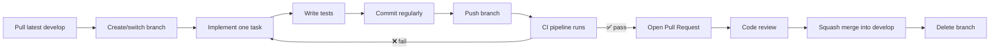

# Software Design Web Application — Team Handbook

Welcome! This site is the single source of truth for how our 6-person team works together for the next **3 months**.

:::info Quick facts
- **Repository hosting:** Gitea (University Server)
- **Branching model:** `main` + `develop` + short-lived task branches
- **Versioning:** Calendar Versioning (CalVer) — `YYYY.MM.REVISION`
- **CI/CD platform:** Gitea Actions
:::

## What's in here

  

### 🌱 [Git Methodology](/git-methodology)
Branching strategy, naming conventions, commit rules, Pull Request workflow, code review, squash merging, and versioning.

  

  

### ⚙️ [CI/CD Strategy](/cicd-strategy)
What CI/CD means for us, the automated pipeline stages, testing policy, coverage targets, and branch protection rules.

  

## The golden rule

:::danger Never do this
Never commit directly to `main` or `develop`. All work happens on a task branch and lands via a reviewed, passing Pull Request.
:::

## Daily workflow at a glance

Use the sidebar (or the cards above) to dive into either document.
