# Open Source Languages — Software Development Blueprint

**A complete development guide from kickoff to deployment**
Team size: 6 · Timeline: 6 weeks · Course: COMS3011A

---

## Table of Contents

1. Project Architecture
2. Software Development Lifecycle
3. Development Workflow
4. Database-First Approach
5. Backend Development Pipeline
6. API Design
7. Frontend Development Pipeline
8. Full Request Lifecycle
9. Authentication Flow
10. Testing Strategy
11. Git Workflow
12. CI/CD Pipeline
13. Project Folder Structure
14. Coding Standards
15. Team Workflow
16. Security Considerations
17. Performance Optimization
18. Deployment
19. Maintenance
20. Project Timeline

---

## 1. Project Architecture

### Purpose
Establish, before anyone writes a feature, exactly which process talks to which — so six people can build in parallel without stepping on each other.

### The shape of the system

This project is **two separately deployable applications plus a static docs site** — not one Next.js app doing everything. That split isn't a style choice; it's a project requirement (non-monolithic frontend/backend, hand-written API).

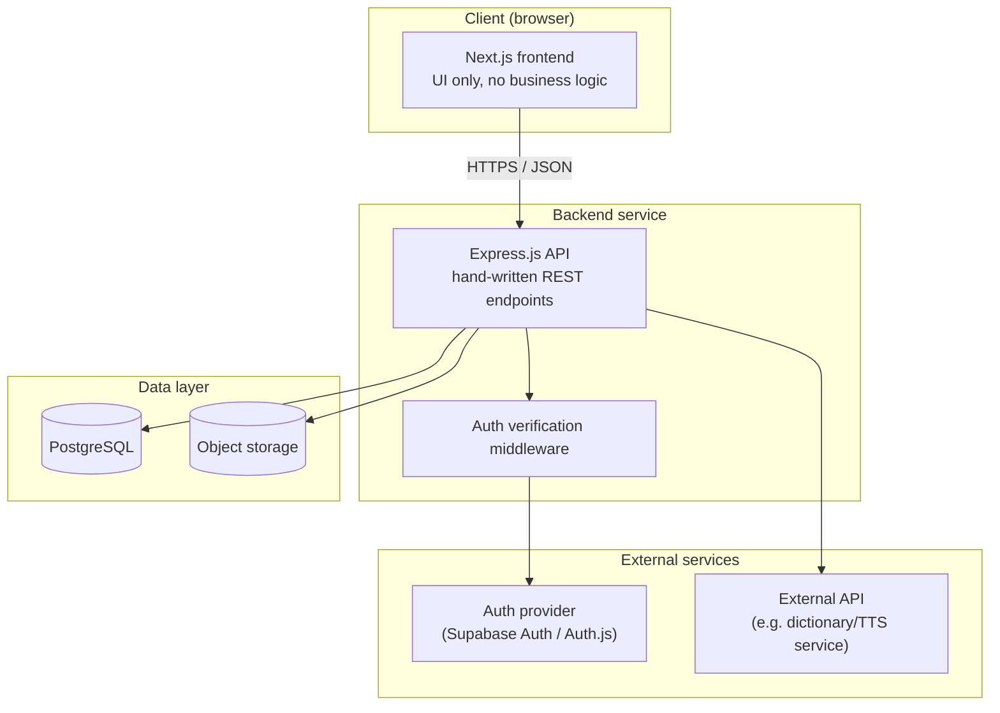

### Why this split matters
- The frontend never talks to the database directly. It only ever calls your Express API.
- The backend never renders HTML. It only ever returns JSON.
- This means the two can be developed, tested, and deployed independently — which is exactly what lets 6 people work in parallel without a merge-conflict nightmare in one repo.

### Component interaction diagram

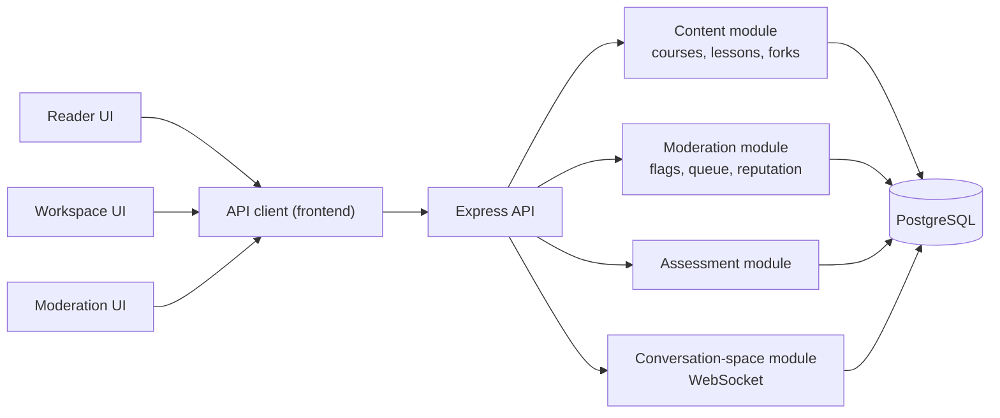

### Exit criteria before moving to Phase 2
- [ ] Everyone agrees the frontend and backend are two separate deployables
- [ ] Everyone can name which module they own
- [ ] The diagrams above are understood by the whole team, not just the lead

---

## 2. Software Development Lifecycle

Given a 6-week timeline, phases overlap rather than running strictly sequentially — but each phase has a clear owner and a clear exit gate.

| Phase | Purpose | Primary owner(s) | Depends on | Exit checklist |
|---|---|---|---|---|
| Requirement analysis | Turn the brief into a feature list | Whole team | — | Feature list agreed, tiers (Basic/Intermediate/Advanced) mapped to weeks |
| Planning | Assign ownership, set conventions | Lead | Requirements | Ownership table filled, API convention doc written |
| System design | Architecture + module boundaries | Lead | Planning | Diagrams in Section 1 approved |
| Database design | Schema, ERD, migrations | Lead + backend team | System design | Schema merged, migrations run cleanly |
| API design | Endpoint contracts | Backend team | Database design | Endpoint list with request/response shapes documented |
| Backend development | Implement endpoints | Backend team (3) | API design | All Basic-tier endpoints pass integration tests |
| Frontend development | Implement UI against real API | Frontend team (2-3) | Backend endpoints exist (even stubbed) | All Basic-tier screens functional |
| Testing | Unit/integration/E2E coverage | Whole team | Features exist | CI green on main |
| Deployment | Ship to production hosting | Lead + CI owner | Testing | App reachable at public URL |
| Monitoring | Confirm it stays up | CI owner | Deployment | Health check + basic logging in place |
| Maintenance | Bug fixes, small iteration | Whole team | Deployment | Ongoing until submission |

:::warning Common mistake
Treating "requirement analysis" and "planning" as a full week of meetings. Timebox this to 2-3 days — the brief is already detailed; the job is translating it into your ownership table and schema, not re-deriving it from scratch.
:::

---

## 3. Development Workflow

Every developer, on every task, follows the same loop:

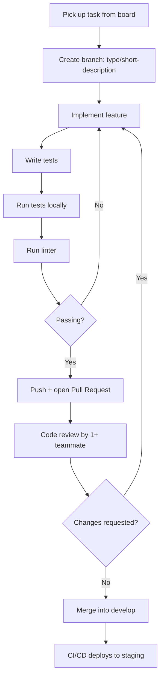

### Best practices
- No one pushes directly to `develop` or `main` — everything goes through a PR, even for a one-line fix.
- A PR that touches `schema.prisma` gets reviewed by the lead specifically, not just any teammate (see Section 11).
- Keep PRs small — one feature or one bug, not a week of accumulated work. Small PRs get reviewed faster and break less.

:::danger Common mistakes
- Merging your own PR without review "because it's just a small fix" — this is how silent breakage creeps into `develop`.
- Writing tests after the PR is already up, as an afterthought to satisfy CI — write them alongside the feature so they actually catch bugs.
:::

---

## 4. Database-First Approach

### From requirements to entities
Read the brief's feature list and pull out every noun that persists: course, lesson, user, suggestion, flag, moderator action, assessment, result, fork, conversation space, session. Each becomes a table. Verbs between them (authors, forks, targets, resolves) become foreign keys or join tables.

### Entity Relationship Diagram

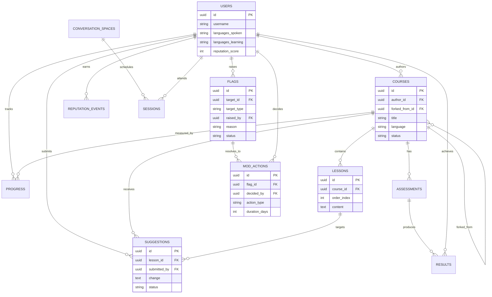

### Normalization notes
- `flags.target_id` is polymorphic (a flag can point at a course, a lesson, or a conversation space) — pair it with `target_type` rather than a strict FK, and enforce validity in application code, not the DB constraint.
- `courses.forked_from_id` self-references `courses` — this single column is the entire fork mechanism. Lineage tracing (Advanced tier) means walking this chain recursively.

### Migration strategy
- One migration per schema change, committed alongside the code that needs it — never hand-edit the database directly, even in development.
- The lead is the only person who merges changes to the shared schema file; everyone else proposes additions via PR (see Section 11).
- Seed a small fixture dataset (a handful of users, courses, lessons) so every developer has consistent local data to test against.

:::tip Exit criteria
- [ ] ERD reviewed and agreed by the whole team
- [ ] Migrations run cleanly from empty on every teammate's machine
- [ ] Seed script produces usable local test data
:::

---

## 5. Backend Development Pipeline

Build bottom-up — nothing above a layer should exist before the layer below it is real.

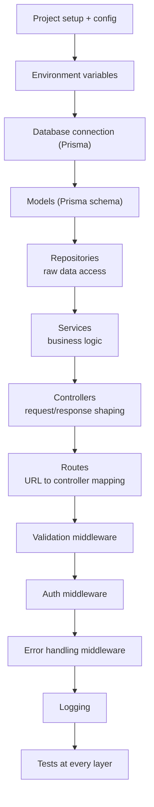

### Why this order
- **Repositories before services**: a service that queries the DB directly is untestable without a real database. A repository layer lets you mock data access in service tests.
- **Services before controllers**: business logic (e.g. "can this user accept this suggestion") should not live inside a controller — controllers only translate HTTP in and out.
- **Validation and auth as middleware, not inline checks**: keeps every route consistent and means you write the check once, not per-endpoint.

### Example folder structure (backend)
```
backend/
  src/
    config/            # env loading, constants
    db/                 # Prisma client, migrations
    models/              # Prisma schema
    repositories/         # data access per entity
    services/             # business logic per domain
    controllers/           # HTTP handlers
    routes/                 # route definitions
    middleware/               # auth, validation, error handling
    utils/
  tests/
    unit/
    integration/
```

:::danger Common mistakes
- Putting SQL/Prisma calls directly in controllers "to save time" — this is exactly what makes fork-merge and moderation logic (the two hardest features) unmanageable once they grow.
- Skipping the repository layer for "simple" entities and then needing it later once a feature turns out non-trivial (forking always turns out non-trivial).
:::

---

## 6. API Design

### Principles
- REST, resource-oriented: `/courses`, `/courses/:id/lessons`, `/courses/:id/suggestions`
- Standard HTTP verbs: GET (read), POST (create), PATCH (partial update), DELETE (remove)
- Consistent status codes: 200/201 success, 400 validation error, 401 unauthenticated, 403 unauthorized, 404 not found, 409 conflict, 500 server error
- Consistent error shape across every endpoint:
```json
{ "error": { "code": "VALIDATION_ERROR", "message": "title is required", "fields": ["title"] } }
```
- Pagination via `?page=1&limit=20`, filtering via query params (`?language=xhosa&level=beginner`), sorting via `?sort=-created_at`
- Versioning: prefix routes with `/api/v1` from day one — free to add now, painful to retrofit
- Rate limiting: apply per-user limits scaled by reputation (ties into the trust engine from the moderation design)

### Request flow

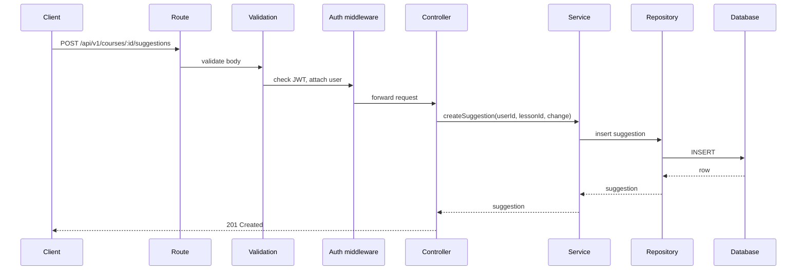

:::tip Exit criteria
- [ ] Every Basic-tier endpoint documented (method, path, request body, response shape, error cases) before implementation starts
- [ ] Error shape and status-code conventions agreed by the whole team
:::

---

## 7. Frontend Development Pipeline

Build in this order — each step needs the one before it to make sense:

1. **Initialize Next.js + TypeScript + Tailwind** — scaffolding first
2. **Configure project** — env vars, API base URL, linting
3. **Folder structure** — routes, components, hooks (see Section 13)
4. **Layout** — shared shell (nav, footer) before any page content
5. **Routing** — page structure mapped to features (reader, workspace, mod queue)
6. **Authentication** — sign-in state available globally before building anything gated
7. **API layer** — a thin typed client wrapping `fetch` to your Express API, used by every page — never call `fetch` ad hoc in components
8. **Reusable components** — buttons, form fields, cards — before building pages that need them repeatedly
9. **State management** — React Context or a light library (e.g. Zustand) for auth/session state; server data via React Query/SWR rather than manual `useEffect` fetching
10. **Pages** — build screen by screen, against the real backend
11. **Forms + validation** — reuse the same validation rules as the backend where practical
12. **Loading and error states** — every data-fetching screen needs both, not just the happy path
13. **Caching** — via React Query's built-in cache, invalidated on mutation
14. **Optimization** — image optimization, code splitting, only once functionality is stable
15. **Testing** — component tests as you go, E2E once flows are stable

### Why this order matters
Building pages before you have a real API client means you either mock everything (and rebuild it all when the mock diverges from reality) or hardcode fetch calls per component (impossible to maintain auth/error handling consistently). The API layer is infrastructure, not a feature — build it once, early.

### Data flow diagram

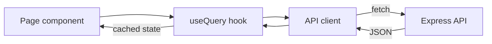

---

## 8. Full Request Lifecycle

Example: a learner submits a correction to a lesson.

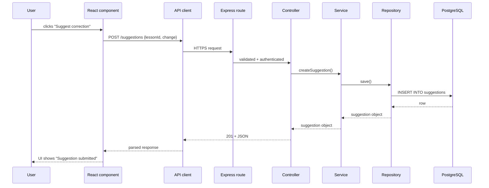

---

## 9. Authentication Flow

Per the requirements: you use an established auth library (Supabase Auth, Auth.js, or similar) — you do not write your own password hashing, token issuance, or session logic.

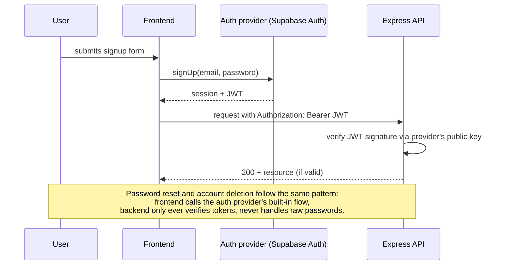

:::tip Required flows (all four are graded explicitly)
- [ ] Sign up
- [ ] Sign in
- [ ] Password reset
- [ ] Account deletion

Account deletion is the one teams forget — build and test it in Week 1 alongside the others, not at the end.
:::

### Authorization on top of authentication
Authentication answers "who is this." Authorization (can this user moderate, can this user edit this course) is your own logic, sitting in the service layer, driven by `reputation_score` and ownership checks — this part you do write yourselves, and it's a core project feature, not boilerplate.

---

## 10. Testing Strategy

| Test type | What it covers | Written by | When |
|---|---|---|---|
| Unit | Individual functions (services, utils) | Feature owner | Alongside the code |
| Integration | API endpoint behavior against a real test DB | Feature owner | Once endpoint works |
| Component | Individual React components in isolation | Frontend owner | Alongside the component |
| End-to-end | Full user flows (sign up → create course → suggest edit) | Whole team, rotating | Once a full flow exists |
| Regression | Re-run of the above on every PR | CI, automatically | Every push |

### Coverage expectations
Aim for meaningful coverage on services and controllers (the logic that can actually break), not 100% coverage on trivial getters. A moderation-decision function with no tests is a bigger risk than an untested `formatDate` helper.

### CI integration
Every PR runs lint → unit → integration tests automatically (see Section 12). A PR cannot merge if any of these fail.

---

## 11. Git Workflow

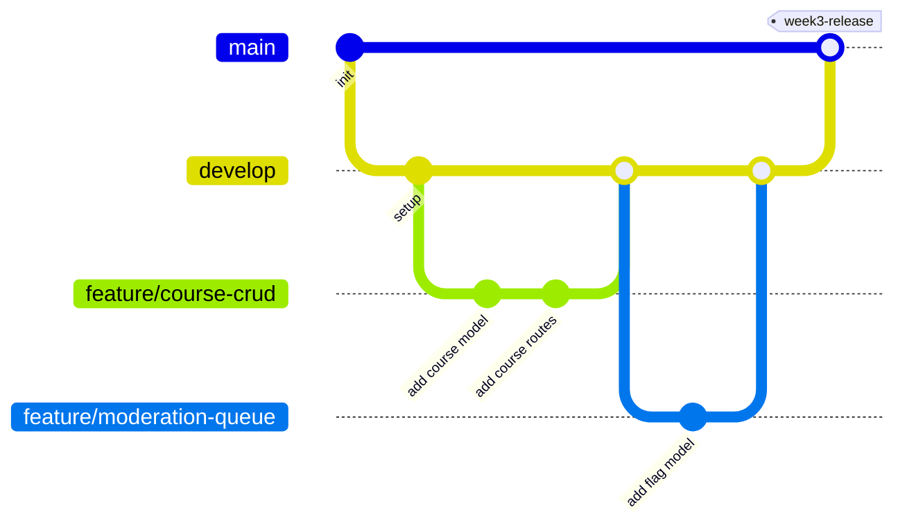

### Branch naming
- `feature/short-description` — new functionality
- `bugfix/short-description` — non-urgent fix
- `hotfix/short-description` — urgent fix to `main`

### Commit conventions
Use Conventional Commits: `feat:`, `fix:`, `test:`, `docs:`, `chore:` — e.g. `feat: add suggestion review endpoint`. This makes the history readable and lets you generate a changelog for free if needed.

### Merge strategy
- Feature branches merge into `develop` via PR, squash-merged to keep history clean
- `develop` merges into `main` at each milestone (end of Basic tier, end of Intermediate tier, final submission)
- The lead is the required reviewer on any PR touching `schema.prisma` or shared middleware/config

:::tip Pull request checklist
- [ ] Tests written and passing
- [ ] Linter passing
- [ ] No direct pushes to `develop` or `main`
- [ ] Description explains what changed and why
:::

---

## 12. CI/CD Pipeline

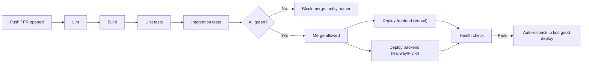

### Example GitHub Actions workflow (backend)
```yaml
name: backend-ci
on:
  pull_request:
    paths: ["backend/**"]
jobs:
  test:
    runs-on: ubuntu-latest
    services:
      postgres:
        image: postgres:16
        env:
          POSTGRES_PASSWORD: test
        ports: ["5432:5432"]
    steps:
      - uses: actions/checkout@v4
      - uses: actions/setup-node@v4
        with: { node-version: 20 }
      - run: npm ci
        working-directory: backend
      - run: npm run lint
        working-directory: backend
      - run: npm run test
        working-directory: backend
```

### Notes
- Run frontend and backend CI as separate jobs, triggered only by changes in their respective folders — keeps CI fast and relevant.
- Deployment triggers only on merge to `main`, never on every PR push.
- Add a rollback step (redeploy the previous successful build) so a bad deploy doesn't take the app down for the rest of the team during a demo prep week.

---

## 13. Project Folder Structure

```
open-source-languages/
  frontend/
    src/
      app/                # Next.js routes
      components/
      hooks/
      lib/                 # API client, utils
      styles/
    tests/
  backend/
    src/
      config/
      db/
      models/
      repositories/
      services/
      controllers/
      routes/
      middleware/
      utils/
    tests/
  docs/                    # Docusaurus site source
  .github/
    workflows/               # CI/CD definitions
  scripts/                   # one-off dev/seed scripts
```

Each folder maps to a section of this document — if you're unsure where a file goes, it should mirror the layer it belongs to in Section 5 or 7.

---

## 14. Coding Standards

| Area | Convention |
|---|---|
| Files | `kebab-case.ts`, React components `PascalCase.tsx` |
| Variables/functions | `camelCase` |
| Types/interfaces | `PascalCase`, prefer `type` for unions, `interface` for object shapes |
| Database tables/columns | `snake_case`, plural table names (`courses`, `mod_actions`) |
| API routes | plural nouns, lowercase, hyphenated (`/courses/:id/suggestions`) |
| React components | one component per file, named exports preferred |
| TypeScript | `strict: true` in `tsconfig.json` from day one — retrofitting strict mode later is far more painful |
| Documentation | every service function gets a one-line JSDoc comment explaining intent, not restating the code |

---

## 15. Team Workflow

- **Sprint length**: weekly, aligned to the tier boundaries in Section 20
- **Daily**: a 10-minute async standup (Slack/Discord message: yesterday, today, blockers) — six people, six weeks, don't spend real meeting time on this
- **Feature ownership**: one primary owner per module (Section 1's ownership table), but anyone can review any PR
- **Definition of Done**: code merged to `develop`, tests passing in CI, docs updated if the change affects setup or API contracts
- **Conflict resolution**: schema and shared-config conflicts go to the lead; feature-level disagreements get a 15-minute sync call rather than a long thread

---

## 16. Security Considerations

- **Authentication**: delegated entirely to the established provider (Section 9) — never store or hash passwords yourselves
- **Authorization**: enforced server-side in the service layer on every mutating endpoint, never trusted from the frontend
- **Input validation**: every request body validated (e.g. via Zod) before it reaches a controller
- **SQL injection**: mitigated by using Prisma's parameterized queries exclusively — never string-concatenate raw SQL
- **XSS**: sanitize any user-generated content rendered as HTML (course/lesson content); React escapes by default, but be careful with any `dangerouslySetInnerHTML`
- **CSRF**: use `SameSite` cookies or bearer tokens rather than cookie-based sessions without CSRF tokens
- **Secrets management**: all keys/secrets in environment variables, never committed — use `.env.example` with placeholder values in the repo
- **Rate limiting**: apply at the API layer, scaled by user reputation, to blunt abuse (ties into the trust-engine design)
- **HTTPS**: enforced by your hosting providers (Vercel/Railway) by default — confirm it, don't assume it

---

## 17. Performance Optimization

| Layer | Techniques |
|---|---|
| Database | Indexes on foreign keys and frequently filtered columns (`courses.language`, `courses.status`) |
| Backend | Pagination on all list endpoints, avoid N+1 queries (use Prisma's `include` deliberately) |
| Frontend | Code splitting via Next.js's automatic per-route splitting, `next/image` for optimized images |
| Caching | React Query cache on the frontend; consider a Redis cache only if a specific endpoint proves slow — don't add it speculatively |
| Real-time | Limit conversation-space payload size, throttle presence updates rather than broadcasting on every keystroke |

Optimize once something is measurably slow — don't spend Week 2 hours on caching a feature that doesn't exist yet.

---

## 18. Deployment

import Tabs from '@theme/Tabs';
import TabItem from '@theme/TabItem';

<Tabs>
  <TabItem value="frontend" label="Frontend (Vercel)" default>
    Connect the GitHub repo, deploy on merge to `main`, and get preview deployments on every PR for free. Set the API base URL as an environment variable so staging and production point at different backends.
  </TabItem>
  <TabItem value="backend" label="Backend (Railway / Fly.io)">
    Connect the repo, set environment variables (DB connection string, auth provider keys, external API keys) in the platform's secret manager — never in code. Expose the `/health` endpoint so the platform can monitor it.
  </TabItem>
  <TabItem value="db" label="Database">
    Use a managed Postgres instance (Supabase-hosted, or Railway's own Postgres add-on). Confirm automatic backups are enabled — don't assume they are by default.
  </TabItem>
</Tabs>

- **Health checks**: a `/health` endpoint returning 200 + basic status, checked by your hosting platform and by CI post-deploy
- **Logging**: structured logs (e.g. via `pino`) shipped to your hosting platform's log viewer — sufficient for a project this size, no need for a dedicated logging service
- **Rollback**: redeploy the last known-good build via your hosting platform's dashboard if a deploy breaks something close to a demo

---

## 19. Maintenance

- **Bug fixes**: triaged the same way user-submitted flags are — a lightweight issue board, not a formal process
- **Dependency updates**: run `npm audit` weekly, update non-breaking patches as you go rather than in one risky batch at the end
- **Database migrations**: every schema change ships with a migration file, tested against the seed dataset before merging
- **Versioning**: tag releases at each milestone (`v0.1-basic-tier`, `v0.2-intermediate-tier`) so you can always point to "what worked" if a later change breaks something
- **Future enhancements**: keep a running "Advanced tier — deferred" list (fork conflict resolution depth, real sockpuppet detection, elected moderators) so your final documentation can honestly state what's implemented vs. designed-only

---

## 20. Project Timeline

| Week | Focus | Key deliverables |
|---|---|---|
| 1 | Foundation | Two repos wired together over HTTP, auth (signup/signin/reset/delete) working end-to-end, CI running lint+test, Docusaurus site live (even empty), schema + migrations merged, API convention doc agreed |
| 2 | Basic tier (backend) | Course CRUD, lessons, suggestions, flags endpoints; conversation-space WebSocket spike started |
| 3 | Basic tier (frontend) + integration | Reader, workspace, profile UI against real backend; **checkpoint: Basic tier demoable end-to-end** |
| 4 | Intermediate tier, part 1 | Assessments, forking, moderation workflow (queue, multi-mod decisions, appeals) |
| 5 | Intermediate tier, part 2 + Advanced tier selection | Reputation scoring, feeds/notifications, turn-managed conversation rooms; pick 2-3 Advanced features to actually build, document the rest |
| 6 | Advanced tier + hardening | Chosen Advanced features complete; accessibility/responsiveness pass; docs site finished (architecture, setup, API reference); integration freeze in final 3-4 days; demo script rehearsed |

### Milestones
- **End of Week 1**: foundation live, nothing user-facing yet, but every piece of infrastructure is real
- **End of Week 3**: Basic tier fully working, deployed, demoable
- **End of Week 5**: Intermediate tier fully working
- **End of Week 6**: submission — Advanced tier partially implemented and honestly documented, full test suite green in CI, docs site complete

---

*This document is a living guide — update it as decisions change, rather than letting the team's actual practice drift away from what's written here.*